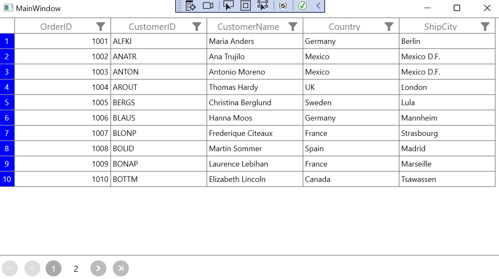
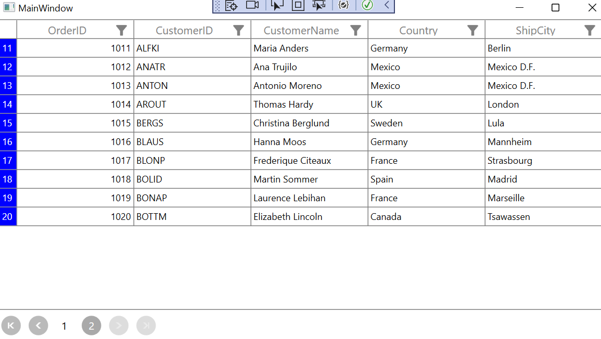

# How to to display the RowIndex in GridRowHeaderCell when combined with SfDatapager in WPF DataGrid

You can display the row index value in the RowHeaderCell by customizing its style with the binding of **RowIndex** to the **TextBlock**.**Text** property, as shown in the link below: 

[Display RowIndex at RowHeaderCell](https://support.syncfusion.com/kb/article/5182/how-to-display-rowindex-at-rowheadercell-in-sfdatagrid-in-wpf-)

Currently, we do not have direct support to display the number of data in the GridRowHeaderCell when combined with SfDataPager. However, you can achieve this functionality by using a MultivalueConverter and handling the PageIndexChanged event in SfDataPager, as demonstrated below:

 ```C# 

        private void SfDataPager_PageIndexChanged(object sender, PageIndexChangedEventArgs e)
        {
            for (int i = 1; i &lt; dataGrid.RowGenerator.Items.Count; i++)
            {
                var rowHeaderCell = ((dataGrid.RowGenerator.Items[i] as DataRow).VisibleColumns[0] as DataColumn).ColumnElement;
                (rowHeaderCell as GridRowHeaderCell).RowIndex = -1;
            }
        }
    
 ``` 

 ```C#

        public object Convert(object[] values, Type targetType, object parameter, CultureInfo culture)
        {
            var dataPager = values[2] as SfDataPager;
            
            if (dataPager.PageIndex == 0 || (int)values[0] == -1)
            {
                return values[0].ToString();
            }
           
                values[0] = (int)values[0] + (((dataPager.PageIndex + 1) - 1) * dataPager.PageSize);
                return values[0].ToString();
          
        }
       
 ```

The index is displayed in RowHeaderCell based on the above customized style like below,




Take a moment to peruse the   [WPF DataGrid - Row Header](https://help.syncfusion.com/wpf/datagrid/rows#row-header) documentation, to learn more about Row Header code examples.