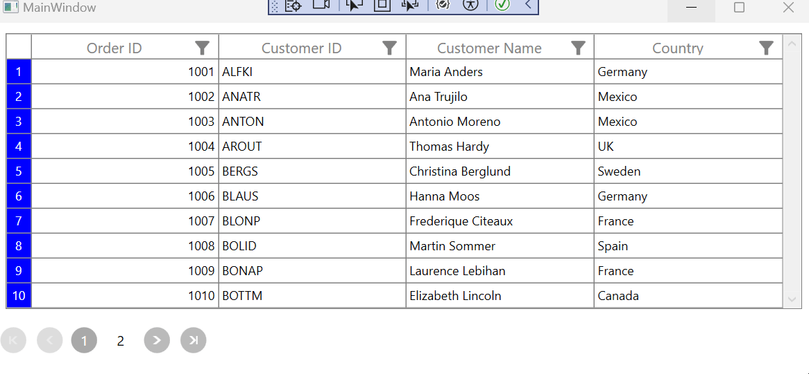

# How to to display the RowIndex in GridRowHeaderCell when combined with SfDatapager in WPF DataGrid

You can display row numbers in the GridRowHeaderCell by customizing the RowHeaderCell style. This can be achieved by binding the RowIndex to the TextBlock.Text property and using a MultiValueConverter. Additionally, you can handle the PageIndexChanged event in SfDataPager. This is demonstrated below.


 ```XML
<Style TargetType="syncfusion:GridRowHeaderCell">
    <Setter Property="Template">
        <Setter.Value>
            <ControlTemplate TargetType="syncfusion:GridRowHeaderCell">
                <Border x:Name="PART_RowHeaderCellBorder"
                        Background="Blue"
                        BorderBrush="{TemplateBinding BorderBrush}"
                        BorderThickness="{TemplateBinding BorderThickness}">
                    <Grid>
                        <!--//RowIndex is displayed here-->
                        <TextBlock HorizontalAlignment="Center"
                                   VerticalAlignment="Center"       
                                   Foreground="White"                                   
                                   TextAlignment="Center"   >
                            <TextBlock.Text>
                                <MultiBinding Converter="{StaticResource rowIndexConverter}" >
                                    <Binding  Path="RowIndex" RelativeSource="{RelativeSource TemplatedParent}"/>
                                    <Binding ElementName="dataGrid"  />
                                    <Binding ElementName="dataPager" />
                                </MultiBinding>
                            </TextBlock.Text>
                        </TextBlock>
                    </Grid>
                </Border>
            </ControlTemplate>
        </Setter.Value>
    </Setter>
</Style>

 ```

 
 ```C#

  private void OnPageIndexChanged(object sender, PageIndexChangedEventArgs e)
  {
    for (int i = 1; i < dataGrid.RowGenerator.Items.Count; i++)
    {
        var rowHeaderCell = ((dataGrid.RowGenerator.Items[i] as DataRow).VisibleColumns[0] as DataColumn).ColumnElement;
        (rowHeaderCell as GridRowHeaderCell).RowIndex = -1;
    }
  }

    
 ```

 ```C#

  public object Convert(object[] values, Type targetType, object parameter, CultureInfo culture)
  {
    var dataPager = values[2] as SfDataPager;

    if (dataPager.PageIndex == 0 || (int)values[0] == -1)
    {
        return values[0].ToString();
    }

    values[0] = (int)values[0] + (((dataPager.PageIndex + 1) - 1) * dataPager.PageSize);
    return values[0].ToString();
  }
       
 ```

The index is displayed in RowHeaderCell based on the above customized style like below,
 

Take a moment to peruse the   [WPF DataGrid - Row Header](https://help.syncfusion.com/wpf/datagrid/rows#row-header) documentation, to learn more about Row Header code examples.
